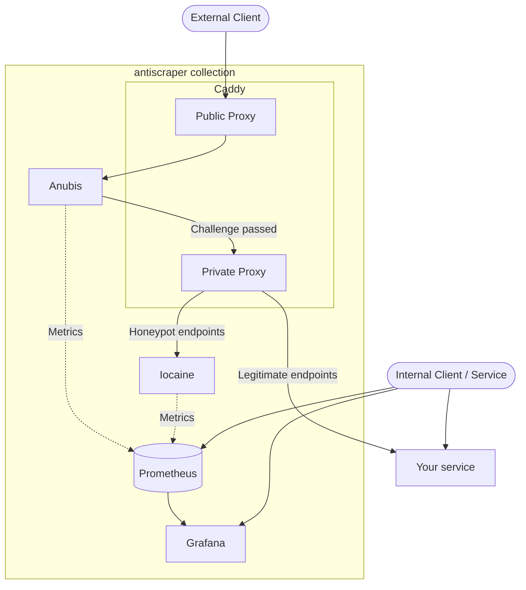

# antiscraper
This project provides a fully self-hosted comprehensive solution for defending against AI scrapers, and actively poisoning particularly persistent ones.

Configurations are provided in the following formats:
- Docker Compose

More configuration formats may be added (i.e. Helm chart, Nix derivation) at a later date.

## Deploying

### Docker Compose

```sh
docker compose up -d
```

## Architecture



A client will follow this basic flow through the system:
1. New clients will receive a challenge from [Anubis](https://anubis.techaro.lol/)
2. Successful clients will be passed through to a Caddy reverse proxy that will handle specific endpoint queries.
3. The Caddy proxy will provide a `robots.txt` file that offers a set of "honeypot" endpoints marked as unallowed.
   - If the client hits one of those honeypot endpoints, they will be redirected to a tarpit served by [iocaine](https://iocaine.madhouse-project.org/)
4. All remaining clients will be passed through to your service.

Services will provide Prometheus metrics (either internally or to an external instance of your choice) so you can see which scrapers are being caught / where they are being sent. You can also include an internal Grafana dashboard for viewing metrics, or use an existing Grafana instance.

## License
This project is licensed under the [GNU General Public License, version 3](LICENSE.md).

*This program is free software: you can redistribute it and/or modify it under the terms of the GNU General Public License as published by the Free Software Foundation, either version 3 of the License, or (at your option) any later version.*<br />
*This program is distributed in the hope that it will be useful, but WITHOUT ANY WARRANTY; without even the implied warranty of MERCHANTABILITY or FITNESS FOR A PARTICULAR PURPOSE.  See the GNU General Public License for more details.*<br />
*You should have received a copy of the GNU General Public License along with this program. If not, see https://www.gnu.org/licenses/.*