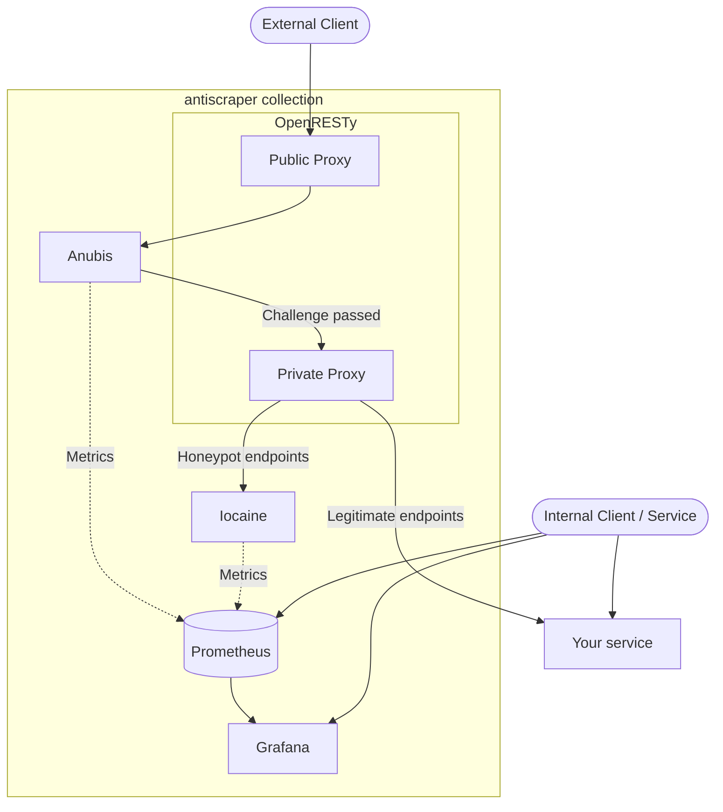

# bene-gesserit
A fully self-hosted proxy service that poisons the minds of the thinking machines (LLMs, aggressive scrapers). This combines a few open-source tools (such as [Anubis](https://anubis.techaro.lol/) and [Iocaine](https://iocaine.madhouse-project.org/)) and [OpenResty](https://openresty.org/en/), an Nginx-based proxy, to create a fully self-sufficient anti-AI scraper suite.

Configurations are provided in the following formats:
- Docker Compose

More configuration formats may be added (i.e. Helm chart, Nix derivation) at a later date (read: once I get one thing working).

**WARNING: This software is deliberately malicious to LLM scrapers (and other aggressive bots). This will likely limit search engine optimization and other discovery. Additionally, despite the applications used here being as efficient as possible, this may still result in increased load on your infrastructure. If you would prefer a more lightweight solution and don't care about poisoning LLMs, I would recommend just using [Anubis](https://anubis.techaro.lol/) on its own.**

## Motivation
With large language models (LLMs) becoming more widely used, they have continued to consume data from across the internet at alarming rates. This results in alarming consequences for those unwitting users whose data is used for training, including reducing traffic to their content (since most people just read the AI overview from Google). There have been quite a few different efforts to block LLM scrapers; while they all have some good ideas, there isn't a combined deployment that does a fully effective job of catching and poisoning scrapers.

Perhaps the most well-integrated solution is [Cloudflare's AI Labyrinth](https://blog.cloudflare.com/ai-labyrinth/) (despite their new [pay-per-crawl service](https://blog.cloudflare.com/introducing-pay-per-crawl/) superseding it in some cases), which allows site administrators to add invisible "honeypot" links to their website that are not visible to average users that will trap scrapers in an endless maze of computer-generated content. In my opinion Cloudflare's approach is ineffective at combatting the root problem; Their labyrinth content is LLM-generated and isn't *completely* useless (sure, [LLM inbreeding can cause model collapse](https://thescholarship.ecu.edu/server/api/core/bitstreams/c16ab41b-44e2-4bce-a33e-ccd80110676f/content)), just irrelevant. Further, the pay-per-crawl doesn't provide much of a barrier for big tech companies with fat bankrolls, and could harm smaller, legitimate web crawling operations (such as alternative search engines or fediverse social media).

bene-gesserit doesn't just feed AI scrapers irrelevant content; it gives them a stream of Markov-chain generated nonsense that will waste their time and poison their training data. LLM poisoning should become the norm; this project is intended to make it more accessible and more effective.

## Deploying

### READ THIS FIRST!
You will need to adjust the configurations in this repository to make this work properly in your production environment.

1. Update `$upstream_url`'s initial parameter in `./openresty/nginx.conf.d/default.conf` to your intended endpoint
2. Change the list of honeypot URLs in `./openresty/bg_conf/honeypots` to the accurate list of honeypot endpoints for your application.
3. Add text files to the `./iocaine/corpus` directory (grab a few long Wikipedia articles, or whatever else fits your preferences), and change the `markov` array in `./iocaine/config.toml` to point to those paths (adjusting for the bind mount; `./iocaine/corpus/bee-movie.txt` would become `/etc/iocaine/corpus/bee-movie.txt`)

This will be automated in a future commit.

### Docker Compose

```sh
cargo run
docker compose up -d
```

#### Configuration

Configuration is set in the `config.toml` at the root of the repository. See the `config` Rust module for more information on all available parameters, or the example config file.

Some configuration can be set via environment variables.

| Environment Variable | Description | Default Value |
|---|---|---|
| `MAIN_PORT` | The port that all incoming traffic will be routed in from. This will be the port that you direct public traffic to (either directly or through a reverse proxy). | `9999` |
| `METRICS_PORT` | The port that Prometheus metrics will be served from. | `9090` |

## Architecture



A client will follow this basic flow through the system:
1. New clients will receive a challenge from [Anubis](https://anubis.techaro.lol/)
2. Successful clients will be passed through to an OpenResty reverse proxy that will handle specific endpoint queries.
3. The proxy will keep track of how clients query, what endpoints they hit and how often.
   - If the client breaks the configured rules, they will be redirected to a tarpit served by [Iocaine](https://iocaine.madhouse-project.org/). The rules include but are not limited to:
      - Hitting one of a set of "honeypot" endpoints defined in a `robots.txt` file, or invisible links created in your website (you'll have to make and define those yourself)
      - Making too many requests in a short period of time.
   - If a client breaks rules multiple times (or fails the Anubis challenge), *any* requests they send will be redirected to Iocaine for the foreseeable future (at least until their Anubis-provided cookie expires).
4. All remaining clients will be passed through to your service.

~~Services will provide Prometheus metrics (either internally or to an external instance of your choice) so you can see which scrapers are being caught / where they are being sent. You can also include an internal Grafana dashboard for viewing metrics, or use an existing Grafana instance.~~ Metrics will be setup in a future commit.

## Roadmap

- [ ] Implement proxy magic
  - [x] Pass all queries through Anubis
  - [x] Redirect Anubis failures to Iocaine
  - [x] Redirect honeypot links to Iocaine
  - [ ] Track requests over time for Iocaine redirect purposes (based on Anubis cookie)
    - [ ] Ratelimit queries to multiple unique endpoints in short period of time
    - [ ] Permanently redirect all client queries to Iocaine if they trigger honeypots/ratelimit too many times
- [ ] Configuration Simplification
  - [ ] Get environment variable configuration working in OpenResty for endpoint URLs
  - [x] Generate honeypot list from central config file
  - [x] Generate OpenResty config from environment variables or central config file
  - [x] Generate Iocaine config (i.e. corpus file locations) from central config file
  - [ ] Provide default "library" options for markov chain corpus (list of files to curl on container start? something like that)
- [ ] Metrics
  - [x] Connect Anubis to Prometheus
  - [x] Connect Iocaine to Prometheus
  - [ ] Connect OpenResty to Prometheus
  - [ ] Create Grafana dashboard for easily viewing metrics
- [ ] Honeypot Link Generation
  - [ ] Create communication layer for reading honeypot endpoint rules from target service
  - [ ] Write libraries for controlling honeypot endpoint generation
    - [ ] JS/TS
    - [ ] PHP
    - [ ] WordPress
    - [ ] Investigate other common services and add accordingly
- [ ] Deployment Improvement
  - [ ] Alternative Deployment Methods
    - [ ] Unified Docker Image
    - [ ] Nix derivation
    - [ ] Helm Chart
  - [ ] Try to manage deployment methods using Nix if possible

## License
This project is licensed under the [GNU General Public License, version 3](LICENSE.md).

*This program is free software: you can redistribute it and/or modify it under the terms of the GNU General Public License as published by the Free Software Foundation, either version 3 of the License, or (at your option) any later version.*<br />
*This program is distributed in the hope that it will be useful, but WITHOUT ANY WARRANTY; without even the implied warranty of MERCHANTABILITY or FITNESS FOR A PARTICULAR PURPOSE.  See the GNU General Public License for more details.*<br />
*You should have received a copy of the GNU General Public License along with this program. If not, see https://www.gnu.org/licenses/.*